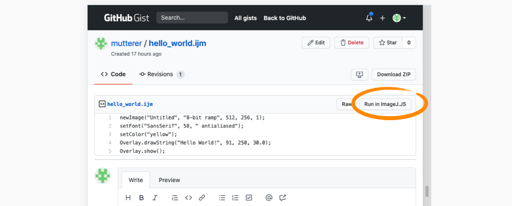

# run-gist-in-imagej-js-extension
A Chrome extension that adds a 'Run in ImageJ.JS' button to GitHubGist

Code is adapted from 'Git History Browser Extension' by Luis Reinoso

# Installation in Chrome
 * Download the code from this repository using the green 'Code' button on this page 
 * Navigate to Chrome>Window>Extensions menu
 * Activate the Developper mode switch at the right hand side of the top menu bar
 * Select 'Load Unpacked' button at the left hand side of the menu bar
 * Point the file browser to the 'extension/' folder of the code you just downloaded
