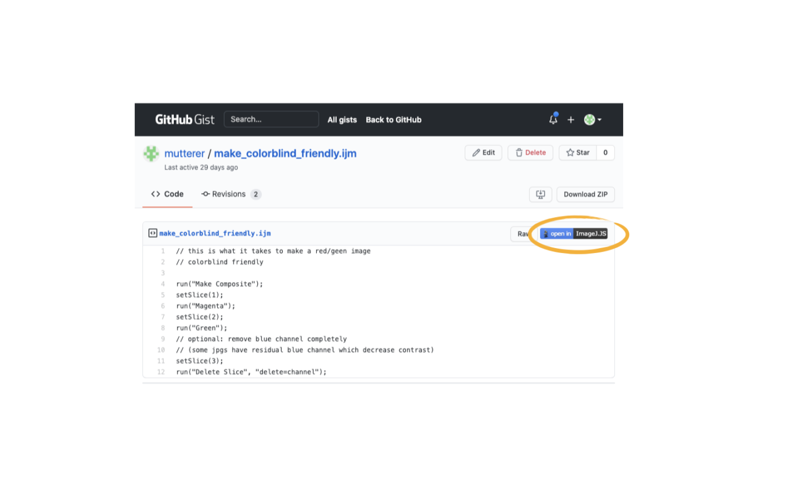

# open-in-imagej-js-extension
A Chrome extension that adds:

 *  button to *.ijm files in **GitHubGist** and **GitHub Repositories** ([example](https://gist.github.com/mutterer/d64e4be80cadd25b409b05d8bf9bef15)).
 *  button to *.ijm and *.tif files in **Zenodo** datasets ([example](https://zenodo.org/record/3375528#.X6j1XZNKjUL)).
*  button to images in the **Human Protein Atlas** ([example](https://www.proteinatlas.org/ENSG00000134057-CCNB1/cell#human)). 

Code is adapted from 'Git History Browser Extension' by Luis Reinoso

# Installation in Chrome
 * Extension is now [published in Chrome Web Store](https://chrome.google.com/webstore/detail/open-in-imagejjs/gneikkcbnfohdpmjidceolbhpigpokij?hl=fr)
 * or you can install it manually:
 * Download the code from this repository using the green 'Code' button on this page (https://github.com/mutterer/run-gist-in-imagej-js-extension) 
 * Navigate to Chrome>Window>Extensions menu
 * Activate the Developper mode switch at the right hand side of the top menu bar
 * Select 'Load Unpacked' button at the left hand side of the menu bar
 * Point the file browser to the 'extension/' folder of the code you just downloaded
